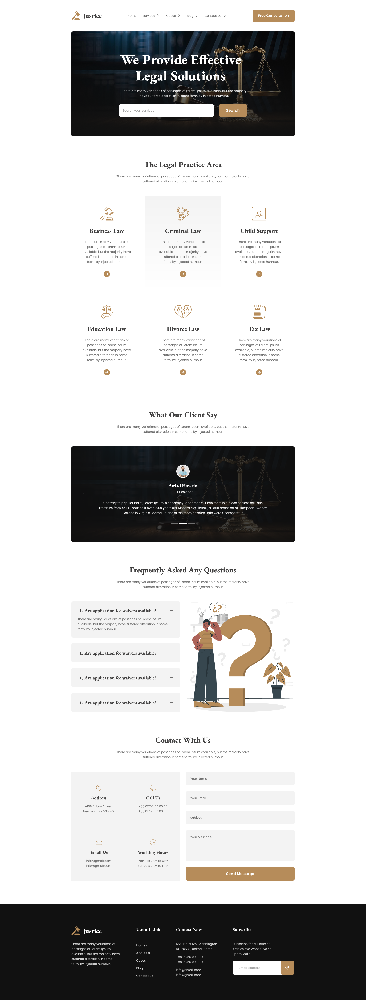

# pghero-assignment3
This project is a clone of the following design. 

## Learning Outcome
1. Bootstrap basics
2. Bootstrap layouts
4. How to make a bootstrap website responsive

## Resource Link
[Click here](https://github.com/ProgrammingHero1/legal-solution-resources)

## Live Website Link
[Click here](https://tangerine-kringle-2d13b1.netlify.app/)

## Helpful Resources
- [Bootstrap documentation](https://getbootstrap.com/docs/5.3/getting-started/introduction/)
